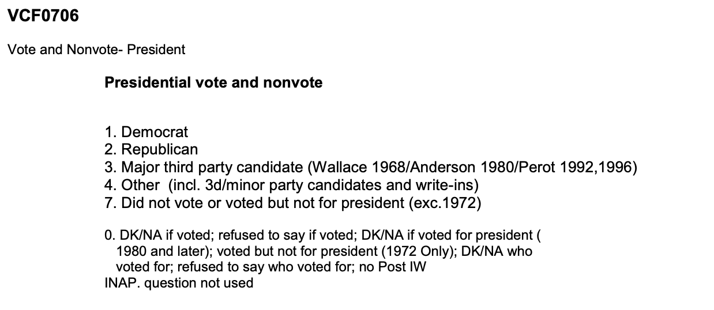

# 1. Introduction & Access to ANES Data
The *American National Election Studies* (ANES) are surveys of voters in the U.S. on the national scale. For each presidential election since 1948, ANES collects responses from respondents both before and after the election. The goal of ANES is to understand political behaviors using systematic surveys. ANES's data and results have been routinely used by news outlets, election campaigns and political researchers.

The *Time Series Cumulative Data* of ANES include answers, from respondents from different years, on selected questions that have been asked in three or more ANES' *Time Series* studies. Tremendous amount of efforts have been put into data consolidation as variables are often named differently in different years. 

# Section 2: Data Pre-processing

## Step 2.1: Checking `R` packages for data processing

From the packages' descriptions:

 `tidyverse` is an opinionated collection of R packages designed for data science. All packages share an underlying design philosophy, grammar, and data structures;
 `haven` enables `R` to read and write various data formats used by other statistical packages. `haven` is part of the `tidyverse`.
 `devtools` provides a collection of package development tools.
 `RColorBrewer` provides ready-to-use color palettes.
 `DT` provides an R interface to the JavaScript library DataTables;
 `ggplot2` a collection of functions for creating graphics, based on The Grammar of Graphics.

```{r load libraries, warning=FALSE, message=FALSE, include=FALSE}

packages.used = as.list(
  c(
    "tidyverse",
    "haven",
    "devtools",
    "RColorBrewer",
    "data.table",
    "ggplot2",
    "olsrr", 
    "haven",
    "car",
    "InformationValue",
    "ggpubr")
)

check.pkg = function(x){
  if(!require(x, character.only=T)) install.packages(x, 
                                                     character.only=T,
                                                     dependence=T)
}

lapply(packages.used, check.pkg)
```

## Step 2.2: Import raw ANES data

You can also embed plots, for example:

```{r read in data, message = F}
library(haven)
anes_dat <-
  read_sav("D:/CU--STAT--MA/GR 5243 Applied Data Science/project 1/Project1-RNotebook-master/doc/anes_timeseries_cdf.sav")

dim(anes_dat) 
```

Some basic data summaries: there are `r nrow(anes_dat)` respondents and `r ncol(anes_dat)` variables.

```{r year barplot}
barplot(table(anes_dat$VCF0004),
        las=2,
        main="number of respondents over the years")
```

Some variables are asked nearly all the years and some are asked only a few years. 

```{r NAs}
anes_NAs=anes_dat%>%
  summarise_all(list(na.mean=function(x){
    mean(is.na(x))}))

anes_NAs=data.frame(nas=unlist(t(anes_NAs)))

ggplot(anes_NAs, aes(x=nas)) + 
  geom_histogram(color="black", 
                 fill="white",
                 binwidth=0.05)+
  labs(title="Fractions of missing values")

```

## Step 2.3: Process variables for analysis

``````{r labelled variables subset}

Election_years = as.character(seq(1952, 2016, 4))

anes_use = anes_dat %>%
  mutate(
    # demographic variables
    year = as_factor(VCF0004), #0
    #vote
    turnout = as_factor(VCF0703), #14038
    vote=as_factor(VCF0706),
    #environment factors
    education = as_factor(VCF0110), #591
    religion = as_factor(VCF0128), #333
    income = as_factor(VCF0114), #5449 
    work = as_factor(VCF0151), #19454
    #natural factors
    gender = as_factor(VCF0104), #144
    race = as_factor(VCF0105a), #1540
    # active component variables 
    meeting = as_factor(VCF0718), # 9076
    activities = as_factor(VCF0723), # 12258
    care = as_factor(VCF0311), #26115
    tv = as_factor(VCF0724), # 22561
    money = as_factor(VCF0742) # 27245
  ) %>%
  filter(year %in% Election_years) 


anes_use <- anes_use %>% filter(!is.na(race)) %>% filter(!is.na(turnout)) %>% filter(!is.na(vote)) %>% filter(!is.na(education))%>%
  filter(!is.na(gender))%>% filter(!is.na(work))%>% filter(!is.na(income)) %>%filter(!is.na(religion))


library(data.table)

data.table(anes_use%>%
             select(year, turnout, vote, race, gender)%>%
             sample_n(30))


anes_use <- anes_use %>% 
select(year, turnout, vote, religion, income, work, education, race, gender, meeting, activities, care, tv, money)

save(anes_use, file="../output/data_use.RData")
```

# Section 3: Natural factors part: Analysis on Gender and Race.


```{r gender}
library(cowplot)
library(ggpubr)

anes_gender <- anes_use %>%
                  filter(!is.na(gender) & turnout == "3. Voted (registered)") %>%
                  group_by(year, gender) %>%
                  count(turnout) %>%
                  group_by(year) %>%
                  mutate(prop = n/sum(n))

p1 <- anes_gender %>%
  ggplot(aes(x = year, y = prop, fill = gender)) +
  geom_bar(stat = "identity", colour = "black") + 
  theme_bw()+
  theme(axis.text.x = element_text(angle = 90))+
  scale_fill_brewer(palette="Blues")+
  labs(title = "Who is More Likely to Vote? Men or Women?") +
  ylab("Proportion")

p2 <- anes_gender %>%
  ggplot(aes(x = year, y = n, group = gender, color = gender)) +
  geom_line() +
  theme_bw() +
  theme(axis.text.x = element_text(angle = 90)) +
  ylab("Number of Voters")

plot_grid(p1, p2)


```

```{r race vote analysis, fig.height=14, fig.width=8}
anes_vote_race_year = anes_use %>%
  filter(!is.na(race) & !is.na(vote))%>%
  filter(vote!="7. Did not vote or voted but not for president (exc.1972)")%>%
  group_by(year, race)%>%
  count(vote)%>%
  group_by(year, race)%>%
  mutate(
    prop=n/sum(n)
  )
#%>%
#  filter(vote == "1. Democrat" | vote == "2. Republican")

ggplot(anes_vote_race_year, 
       aes(x=year, y=prop, fill=vote)) +
  geom_bar(stat="identity", colour="black")+ 
  scale_fill_manual(values=c("dodgerblue3", "firebrick2", "gold1", "lightgoldenrod1"))+
  facet_wrap(~race, ncol=1) + 
  theme(axis.text.x = element_text(angle = 90))+
  labs(title="Who did racial groups vote for in the election \n over the years?")

```

From the above two graphs, it's clear that White non-Hispanic racial group is more likely to vote than any other racial groups. The second most likely racial group is Black non-Hispanic. I also notice that the proportion of Hispanic voters are gradually increasing over the past few elections.


# Section 4: Enviroment factors part: Analysis on Religion, Education and work.

## 4.1 Who did they vote for in the election?



```{r religion vote analysis, fig.height=14, fig.width=8}
anes_vote_religion_year = anes_use %>%
  filter(!is.na(religion) & !is.na(vote))%>%
  filter(vote!="7. Did not vote or voted but not for president (exc.1972)")%>%
  group_by(year, religion)%>%
  count(vote)%>%
  group_by(year, religion)%>%
  mutate(
    prop=n/sum(n)
  )
#%>%
#  filter(vote == "1. Democrat" | vote == "2. Republican")

ggplot(anes_vote_religion_year, 
       aes(x=year, y=prop, fill=vote)) +
  geom_bar(stat="identity", colour="black")+ 
  scale_fill_manual(values=c("dodgerblue3", "firebrick2", "gold1", "lightgoldenrod1"))+
  facet_wrap(~religion, ncol=1) + 
  theme(axis.text.x = element_text(angle = 90))+
  labs(title="Who did religion groups vote for in the election \n over the years?")
```


Even though the proportion of protestants has decreased over time, they still accounted for a large segment of the voters, and the proportion of other religion and non-religious has drastically increased.

```{r education vote analysis, fig.height=14, fig.width=8}
anes_vote_education_year = anes_use %>%
  filter(!is.na(education) & !is.na(vote))%>%
  filter(vote!="7. Did not vote or voted but not for president (exc.1972)")%>%
  group_by(year, education)%>%
  count(vote)%>%
  group_by(year, education)%>%
  mutate(
    prop=n/sum(n)
  )
#%>%
#  filter(vote == "1. Democrat" | vote == "2. Republican")

ggplot(anes_vote_education_year, 
       aes(x=year, y=prop, fill=vote)) +
  geom_bar(stat="identity", colour="black")+ 
  scale_fill_manual(values=c("dodgerblue3", "firebrick2", "gold1", "lightgoldenrod1"))+
  facet_wrap(~education, ncol=1) + 
  theme(axis.text.x = element_text(angle = 90))+
  labs(title="Who did education groups vote for in the election \n over the years?")

```

```{r work vote analysis, fig.height=14, fig.width=8}
anes_vote_work_year = anes_use %>%
  filter(!is.na(work) & !is.na(vote))%>%
  filter(vote!="7. Did not vote or voted but not for president (exc.1972)")%>%
  group_by(year, work)%>%
  count(vote)%>%
  group_by(year, work)%>%
  mutate(
    prop=n/sum(n)
  )
#%>%
#  filter(vote == "1. Democrat" | vote == "2. Republican")

ggplot(anes_vote_work_year, 
       aes(x=year, y=prop, fill=vote)) +
  geom_bar(stat="identity", colour="black")+ 
  scale_fill_manual(values=c("dodgerblue3", "firebrick2", "gold1", "lightgoldenrod1"))+
  facet_wrap(~work, ncol=1) + 
  theme(axis.text.x = element_text(angle = 90))+
  labs(title="How different work groups vote for in the election \n over the years?")

```


# Conclusion
## Typical Voter
Based on the above exploratory data analysis, a typical voter has the following natural and enviroment characteristics:  
  
* White non-Hispanic;  
* woman; 
* aged between 45 and 64;  
* at least goes to some college, may or may not have degree;  
* professional or management jobs;  
* protestant;  


